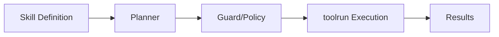

# User Journey: Building a Skill

## Scenario

You want to define a reusable "summarize-research" skill that searches for
papers, extracts abstracts, and summarizes the result.

## Step 1: Define the skill

```go
skill := toolskill.New("summarize-research").
    Step("search", "mcp:search_papers").
    Step("extract", "mcp:extract_abstracts").
    Step("summarize", "mcp:summarize")
```

## Step 2: Add a guard

```go
skill = skill.WithGuard(toolskill.MaxSteps(5))
```

## Step 3: Execute via toolrun

```go
executor := toolrun.NewExecutor(...)
result, _ := toolskill.Execute(ctx, skill, executor)
```

## Flow Diagram


