# User Journey: Building a Skill

## Scenario

You want to define a reusable "summarize-research" skill that searches for
papers, extracts abstracts, and summarizes the result.

## Step 1: Define the skill

```go
skill := toolskill.Skill{
    Name: "summarize-research",
    Steps: []toolskill.Step{
        {ID: "search", ToolID: "mcp:search_papers"},
        {ID: "extract", ToolID: "mcp:extract_abstracts"},
        {ID: "summarize", ToolID: "mcp:summarize"},
    },
}
```

## Step 2: Add a guard

```go
guard := toolskill.MaxStepsGuard(5)
_ = guard.Validate(skill)
```

## Step 3: Execute via toolrun

```go
plan, _ := toolskill.NewPlanner().Plan(skill)
executor := toolrun.NewExecutor(...)
result, _ := toolskill.Execute(ctx, plan, executor)
```

## Flow Diagram

```mermaid
%%{init: {'theme': 'base', 'themeVariables': {'primaryColor': '#6b46c1'}}}%%
flowchart LR
    subgraph definition["Definition"]
        A["🎯 Skill Definition<br/><small>name, steps[]</small>"]
    end

    subgraph planning["Planning"]
        B["📐 Planner<br/><small>dependency resolution</small>"]
        C["🛡️ Guard/Policy<br/><small>MaxSteps, AllowedNS</small>"]
    end

    subgraph execution["Execution"]
        D["▶️ toolrun.RunChain()<br/><small>step-by-step</small>"]
    end

    subgraph output["Output"]
        E["📦 SkillResult<br/><small>final + step results</small>"]
    end

    A --> B --> C --> D --> E

    style definition fill:#6b46c1,stroke:#553c9a,stroke-width:2px
    style planning fill:#d69e2e,stroke:#b7791f
    style execution fill:#38a169,stroke:#276749
    style output fill:#3182ce,stroke:#2c5282
```



## Skill Execution Pipeline

```mermaid
%%{init: {'theme': 'base', 'themeVariables': {'primaryColor': '#6b46c1'}}}%%
flowchart TB
    subgraph skill["Skill: summarize-research"]
        S1["📌 Step 1<br/><small>mcp:search_papers</small>"]
        S2["📌 Step 2<br/><small>mcp:extract_abstracts</small>"]
        S3["📌 Step 3<br/><small>mcp:summarize</small>"]
    end

    subgraph guards["Guards"]
        G1["🛡️ MaxStepsGuard(5)"]
        G2["🔒 AllowedNamespaces(['mcp'])"]
    end

    subgraph planner["Planning"]
        Plan["📐 Planner.Plan()"]
        ExecPlan["📜 ExecutionPlan"]
    end

    subgraph execution["Execution"]
        Exec["▶️ toolskill.Execute()"]
        Chain["🔗 toolrun.RunChain()"]
    end

    subgraph results["Results"]
        R1["📄 Step 1 Result: papers[]"]
        R2["📄 Step 2 Result: abstracts[]"]
        R3["📄 Step 3 Result: summary"]
        Final["📦 Final: summary"]
    end

    S1 --> S2 --> S3
    S3 --> G1
    S3 --> G2
    G1 --> Plan
    G2 --> Plan
    Plan --> ExecPlan --> Exec --> Chain
    Chain --> R1 --> R2 --> R3 --> Final

    style skill fill:#6b46c1,stroke:#553c9a
    style guards fill:#e53e3e,stroke:#c53030
    style planner fill:#d69e2e,stroke:#b7791f
    style execution fill:#38a169,stroke:#276749
    style results fill:#3182ce,stroke:#2c5282
```


